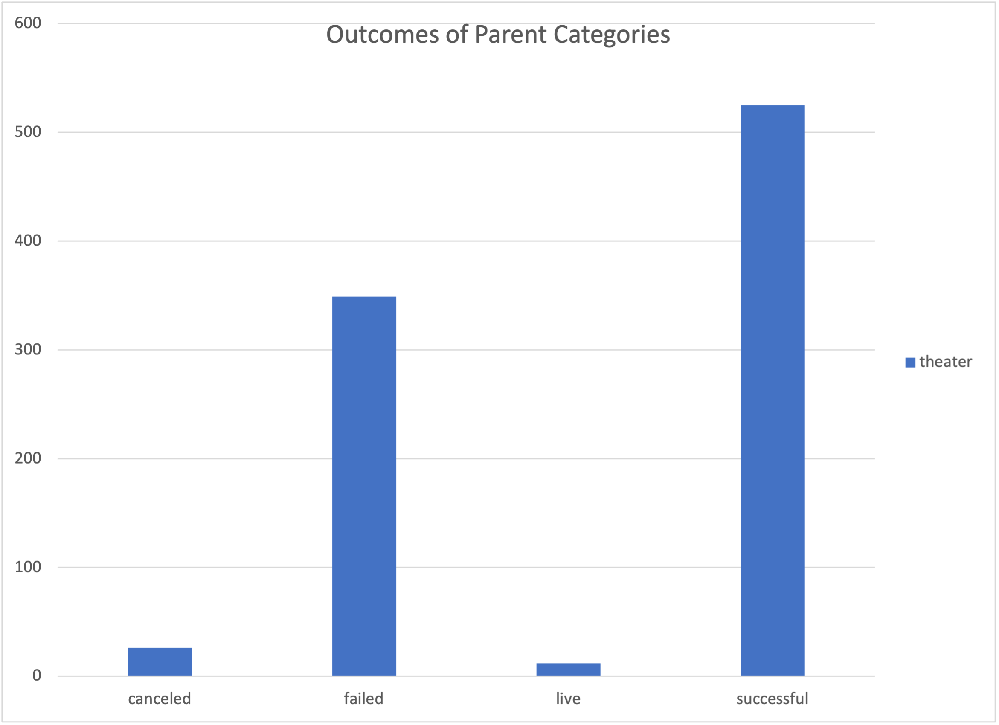
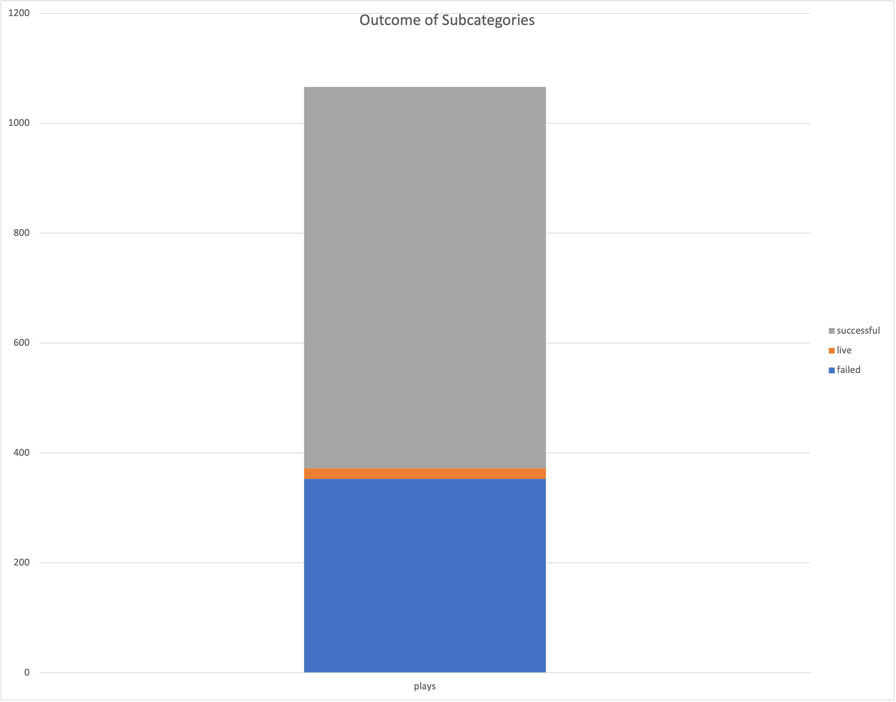
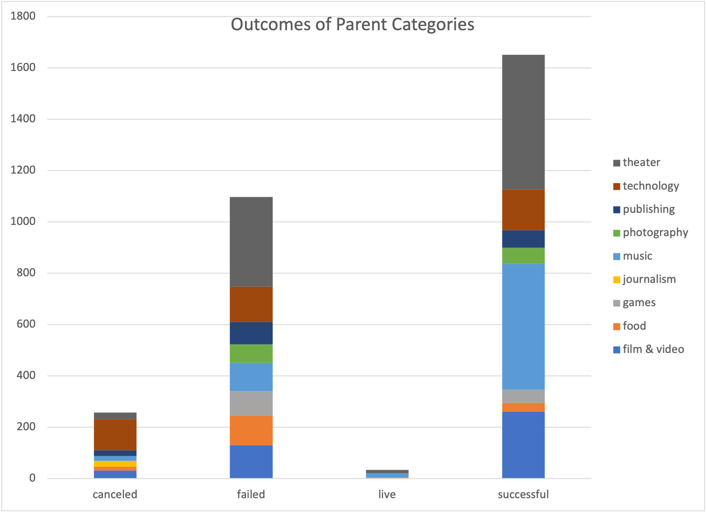
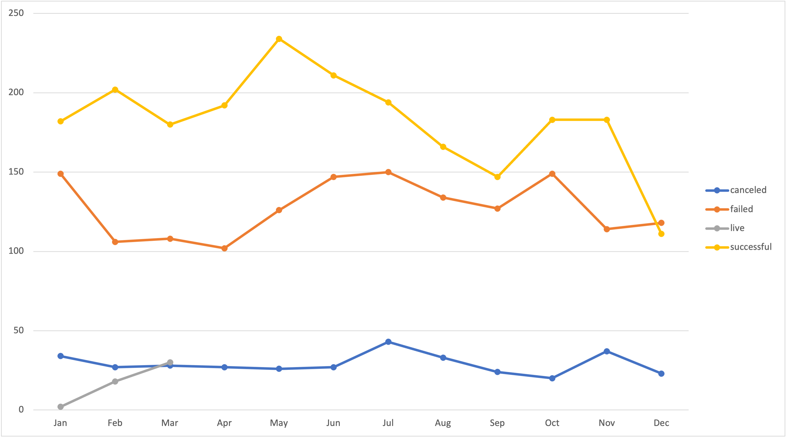
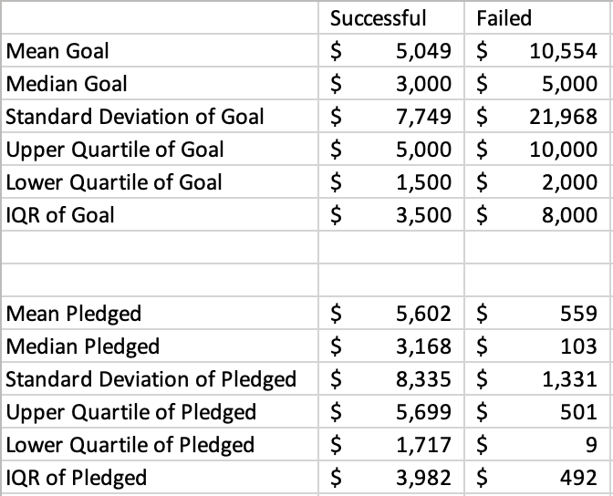

# Analysis of Kickstarter Campaigns
This project was created in order to help Louise, a playwright, figure out which elements will make her play a success. This analysis is done with old crowdfunding data, helping narrow down the exact elements that have made older plays successful in the past. Our goal is to give Louise a roadmap to follow in order to set up her campaign for success. 

Overall, plays had pretty successful results in previous campaigns. The theater category had mostly positive results, and most plays were successful.
The two images below show how many successful campaigns there were in the theater and play categories, followed by a chart outlining all categories and whether they were successful or not. Most plays were a success, and the theater category had one of the best results as far as successes. 

The conclusion from above, solidifies the fact that Louise has a good chance of creating something successful, since it's part of the theater and play category, both of which showed that most succeeded.
Following the above analysis, we looked at the time of year and how that correlated with successful launches of theater campaigns. The image below indicates that it would be best for Louise to start her campaign in May. May had the highest number of successes throughout all theater campaigns. 

As far as fundraising goes, looking at a short statistical analysis of the ranges within which successful campaigns operated (as far as fundraising goals and actual pledged amounts), these statistics are outlined below (successful vs failed):

Based on these graphs, it seems that Louise's goal of raising $10,000 is somewhat unrealistic, and falls outside the graph. If we look at unsuccessful campaigns, their mean goal was $10,554, which is not a great sign.

Although the category that Louise has chosen will likely be profitable, I would recommend that she launch her campaign in May, and instead of a $10,000 goal, look for something in the range of $1,500 - $5,000.
